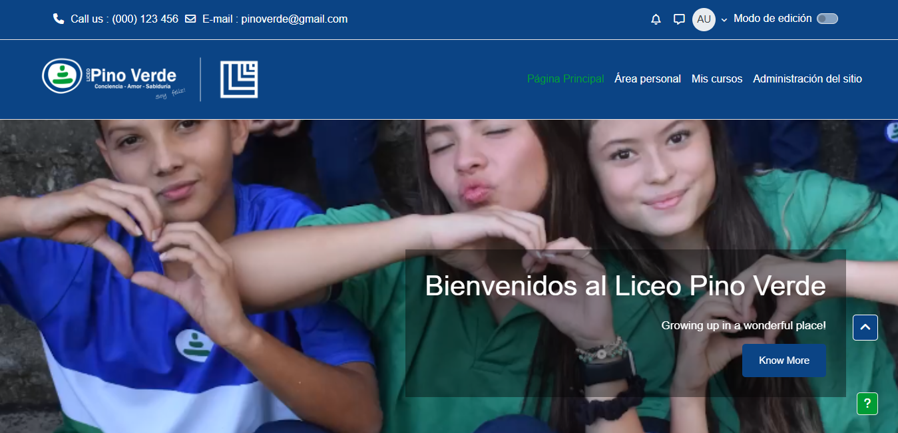

# 🎓 Tema Moodle: Pinoverde

Tema personalizado para la plataforma Moodle del **Liceo Pino Verde**, basado en el tema [Academi](https://moodle.org/plugins/theme_academi). Este tema adapta la identidad visual de la institución, permite personalización a través del panel de administración y está optimizado para una experiencia limpia, moderna y educativa.

---

## 📸 Vista previa

| Pantalla Principal |
|--------------------|
|  |

---

## ✨ Características principales

- 🔵 Basado en el tema *Academi* de Moodle.
- 🎨 Colores institucionales aplicados en encabezados, botones, enlaces y fondos.
- 🖼️ Logotipo institucional integrado y configurable desde el panel de administración.
- 🧩 Configuración personalizada accesible desde el área de administración.
- 📱 Diseño responsive compatible con dispositivos móviles.
- 🧠 Código limpio y modular, fácil de extender.

---

## 📦 Estructura del tema

pinoverde/
├── amd/ # Módulos AMD JS (frontpage, slider, etc.)
│ ├── build/ # Archivos JavaScript compilados
│ └── src/ # Archivos fuente JavaScript
├── lang/ # Archivos de idioma (en, es, etc.)
├── pix/ # Imágenes del tema (logos, íconos)
├── scss/ # Estilos personalizados en SCSS
├── templates/ # Plantillas de salida (layouts, partials)
├── config.php # Configuración del tema
├── lib.php # Funciones auxiliares del tema
├── settings.php # Panel de configuración en el administrador
├── version.php # Versión del tema y requisitos de Moodle
└── README.md # Este archiv

---

## ⚙️ Instalación

1. **Ubica la carpeta:**
   Coloca la carpeta `pinoverde` dentro del directorio `/theme/` de tu instalación de Moodle.

2. **Asigna los permisos correctos:**
   ```bash
   sudo chown -R www-data:www-data /ruta-a-tu-moodle/theme/pinoverde
